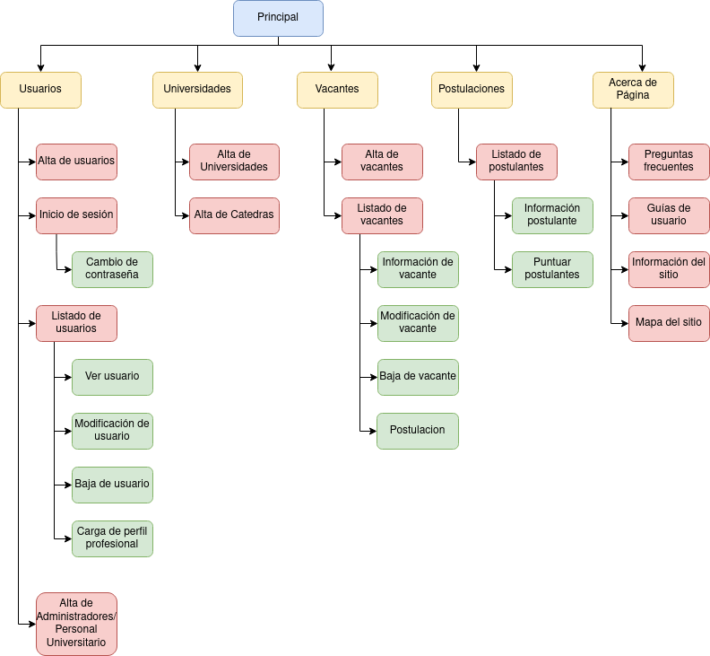
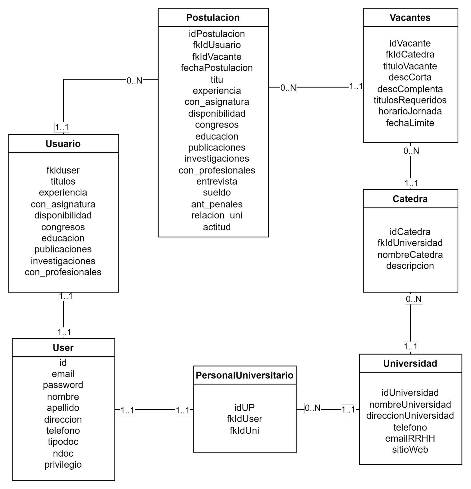
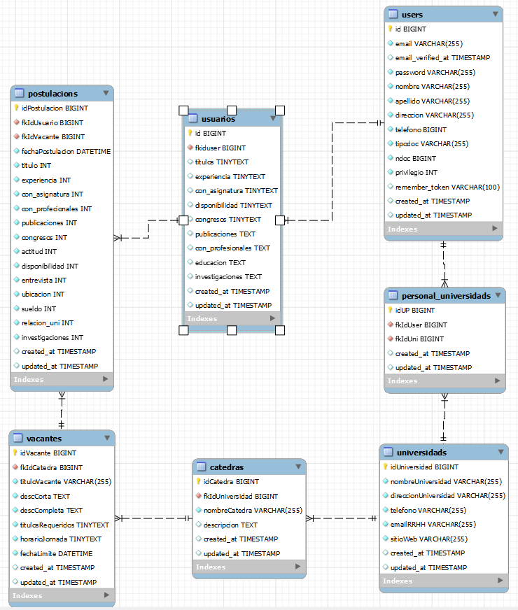

<picture>
    <source media="(prefers-color-scheme: dark)" src="./public/img/Vacantes_Alt.png" alt="Logo de AcademyHub">
    <source media="(prefers-color-scheme: light)" src="./public/img/academy.png" alt="Logo de AcademyHub">
    
</picture>

# [AcademyHub](https://academy-hub.000webhostapp.com/)

## Descripción del [sitio](https://academy-hub.000webhostapp.com/about)

El sitio será un módulo destinado a la gestión de los llamados a cubrir vacantes de distintas universidades. Informará de la apertura de los llamados y permitirá la postulación para las vacantes. Permitirá registrar y gestionar los Curriculum vitae de los postulantes y la visualización de los mismos para los usuarios de la universidad. Informará también de los resultados de órdenes de mérito a los postulantes, de manera que todos los usuarios externos a la universidad puedan ver los resultados.

## Objetivo general del sitio

El objetivo principal del sitio es gestionar los llamados a cubrir vacantes en las distintas cátedras de cada universidad. 
Para ello deberá:
- Realizar la apertura de llamados a cubrir vacante en las cátedras del departamento de sistemas.
- Realizar el registro de los CV de los postulantes. 
- Publicar los resultados de los órdenes de mérito de las diferentes vacantes que se realizan, para que todos los usuarios puedan visualizarlas.
- Mantener un registro histórico de las vacantes cubiertas.
- Mantener un registro de puntuaciones del orden de mérito.
- Notificar a los postulantes de los resultados de los órdenes de mérito.

## [Mapa del sitio](https://academy-hub.000webhostapp.com/map)

## Modelo lógico

## Modelo Físico

